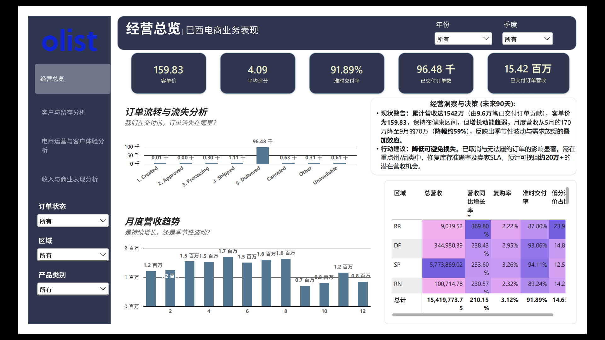
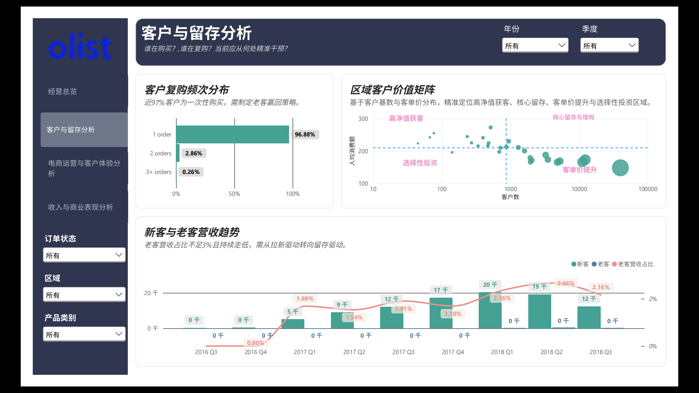
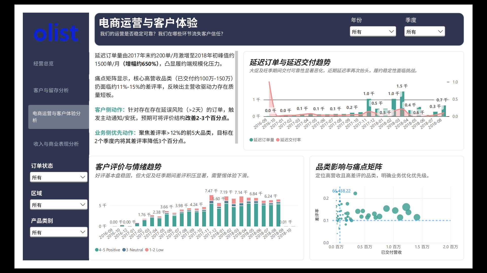
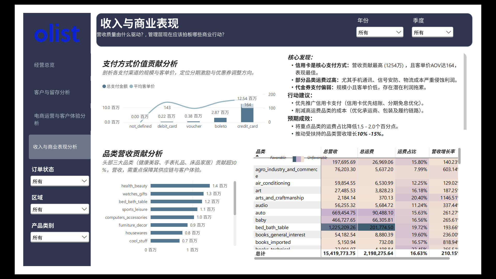

# Olist 巴西电商BI项目

基于 Olist 巴西电商公开数据集，使用 MySQL 完成数据清洗与建模，通过语义层视图统一分析口径，用 SQL 回答核心业务问题，并用 Power BI 构建管理层仪表板，形成从数据到决策的完整分析体系。

## 1. 项目简介

本项目围绕 Olist 巴西电商平台数据展开，目标是把原始 CSV 数据转化为可用于 BI 分析和业务决策的数据。

项目覆盖完整地分析链路：

- 数据准备 ETL：清洗、类型转换、主外键、索引、去重。
- 语义层建模：创建 dim_* 和 fact_* 视图，统一分析口径。
- 业务分析：用 10 个 SQL 查询回答收入、客户、物流、评分、支付等问题。
- 可视化与决策：通过 4 个 Power BI 仪表板呈现 KPI、洞察和行动优先级。

## 2. 技术栈

|  层级  |              工具/技术               |
|:----:|:--------------------------------:|
| 数据库  |              MySQL               |
| 数据处理 |         SQL（ETL、视图、分析查询）         |
| 语义层  |            MySQL View            |
| 可视化  |             Power BI             |
| 数据源  | Olist Brazilian E-Commerce 公开数据集 |
|  文档  |             Markdown             |

## 3. 项目结构

```text
PowerBiProject/
|- data/
|  |- olist_*.csv
|- SQL/
|  |- ETL.sql
|  |- analysis .sql
|  |- views.sql
|- dashboard/
|  |- 巴西电商业务分析仪表盘.pdf
|  |images/
|- README.md
```

## 4. SQL层说明

### 4.1 ETL.sql —— 数据准备

ETL.sql 将原始 Olist CSV 转换为分析就绪的关系型数据库，负责：

- 设置字段类型与 NOT NULL 
- 建立主键、外键和索引 
- 转换日期格式 
- 清理无效日期 
- 去重评论数据 
- 保证引用完整性

主要阶段：

| 阶段 | 内容 |
|:--:|:--:|
| 设置 |  禁用外键检查，方便开发期重跑  |
| 1–5 |  主表：产品类别翻译、产品、卖家、客户、地理位置  |
| 6–9  |  事务表：订单、订单商品、支付、评论  |
| 完成  |  重新启用外键检查  |

### 4.2 views.sql —— 语义层视图

views.sql 创建可复用的 BI 语义层，让后续查询不用反复 JOIN 原始表。

|            视图             |   类型   |           粒度            |             用途              |
|:-------------------------:|:------:|:-----------------------:|:---------------------------:|
|       dim_customer        |  客户维度  | 一行一个 customer_unique_id |      客户城市、首单、末单、终身订单数       |
|        dim_product        |  产品维度  |         一行一个产品          |    类别英文、名称/描述长度、照片数、重量尺寸    |
|        fact_orders        |  订单事实  |         一行一个订单          | 客户键、订单状态、购买/审批/交付/预估时间、是否交付 |
| fact_order_items_enriched | 订单商品事实 |        一行一个订单商品行        | 产品键、客户键、价格、运费、行收入、客户州、英文类别  |

Power BI 和后续分析优先连接这些视图，而不是直接查原始表。

### 4.3 analysis .sql —— 业务分析

analysis .sql 回答 10 个核心业务问题：

| 编号  | 业务问题 | 输出 |
|:---:|:----:|:--:|
| Q1  |   月度收入趋势   |  月份、总收入、订单数  |
| Q2  |   收入最高的 10 个产品类别   |  英文类别、收入、订单数  |
| Q3  |   按支付方式看 AOV   |  支付方式、平均订单金额、订单数  |
| Q4  |   哪些州贡献收入最多   |  州、收入、去重客户数  |
| Q5  |   复购率   |  1 单 / 2 单 / 3+ 单客户数及占比  |
| Q6  |   配送表现：延迟 vs 准时   |  准时/延迟订单数、平均配送天数  |
| Q7  |   各类别运费占订单价值比例   |  品类、总运费、总产品价值、运费占比  |
| Q8  |   低评分订单占比   |  1–5 星评论数量及百分比  |
| Q9  |   哪些品类低评分评论最多   |  品类、低评分数量、平均分  |
| Q10 |   客户如何支付   |  支付方式、订单数、总金额、收入占比  |

## 5. Power BI 仪表板

Power BI 文档把分析结果转化为面向领导层的业务叙事、KPI 和行动建议。

### Dashboard 1 - 经营总览 / 巴西电商业务表现

回答的问题： 整体业务健康状况如何，最大的机会和风险在哪里？



#### 数字背后的故事

|   KPI   |   数值   | 行业语境 |
|:-------:|:------:|:----:|
| 已交付订单营收 | 1542万  |  基础较强，可对标市场份额目标    |
| 已交付订单数  |  9.6万  |   规模确认，可对比取消/不可用订单   |
|   客单价   | 159.83 |  健康，通用市场平台常在 100–200    |
|  平均评分   |  4.09  |   正面，通常 >4.0 代表满意度较好   |
|  准时交付率  | 91.89% |   良好，但最佳水平常 >95%，有提升空间   |

#### 1）收入势头与季节性

- 观察：月度收入从5月的峰值170万下降约59%至9月的约70万（月度收入趋势）。
- 影响：强劲的上半年（如5月170万，8月163万）和明显的第三/四季度低谷表明存在季节性和/或需求放缓。
- 建议： 
     - 在较慢的月份（第三/四季度）开展有针对性的活动和促销以平滑需求。
     - 使用季节性需求预测进行库存管理（避免淡季库存过剩、旺季缺货）。
     - 在低需求期使用忠诚度和再激活策略以保持购买频率。

#### 2）订单流程：我们在哪里丢失订单？

- 已交付：9.6万 订单（与主要KPI一致）。 
- 主要损失点：已取消（约630）和无法履约订单（约610）——直接收入流失；经营洞察面板估计约20万+的收入机会。 
- 行动： 
     - 库存准确性： 实时库存和定期审计以减少“无法提供”导致的取消。
     - 卖家SLA： 收紧履约和沟通SLA；优先关注头部州和品类。
  
### Dashboard 2 - 客户与留存分析

回答的问题：客户是谁？多久买一次？留存如何？



#### 故事：获客强劲，留存薄弱（“漏桶”现象）

|    指标     |          数值          |      影响       |
|:---------:|:--------------------:|:-------------:|
| 仅购买1次的客户  |        96.88%        | 几乎所有客户都是一次性买家 |
|  购买2次的客户  |        2.86%         |  第二次购买转化率极低   |
| 购买3次以上的客户 |        0.26%         |    忠诚客户群极小    |
|  回头客营收占比  | 峰值 2.66%（2018年第二季度）  |  收入绝大多数来自新客户  |
|  新客户（季度）  | 最高 约20.3K（2018年第一季度） |   获客引擎运转良好    |
|  回头客（季度）  |        约0–400        |   留存引擎表现不佳    |

实际上：获客成本（CAC）没有转化为客户终身价值（CLTV）；增长依赖于持续获客，这既昂贵又不稳定。

#### 1）购买频率——修复漏桶

- 行动：
     - 唤回活动： 在30–60天未进行第二次购买后，发送个性化优惠（如折扣、免运费、推荐）。目标：下一季度将1–2个百分点的1次购买客户转化为2次购买。 
     - 购后体验： 在用户首次下单后发问卷、邀请评价；用这些反馈来优化新客引导和客服支持；追踪“填写了问卷的人”的客户满意度（CSAT）、净推荐值（NPS）和复购率。
     - 忠诚度计划： 从首次购买开始建立分级计划（积分、专属权益）；追踪注册率和各层级的复购率。

#### 2）区域客户价值矩阵（州 × 每客户收入）

|   象限    | 含义 |        行动         |
|:-------:|:--:|:-----------------:|
|  高净值获客  |  每客户收入高，客户数少  |  通过相似受众和细分活动扩大规模  |
| 核心留存与增购 |  每客户收入高，客户数多  |      VIP待遇、留存、接近零流失目标。             |
|  客单价提升  |  每客户收入低，客户数多  |     提高AOV和频率（捆绑、推荐、“多买多省”）              |
|  选择性投资  | 每客户收入低，客户数少   |        仅在具有战略意义的地方投资           |


### Dashboard 3 - 电商运营与客户体验

回答的问题： 我们的运营是否可靠，我们在哪里失去了客户信任？



#### 1） 延迟订单与规模压力

|   时期   |  延迟订单   | 影响 |
|:------:|:-------:|:--:|
| 2017年末 | 约200/月  | 基线 |
| 2018年初 | 约1500/月 |  约650%增长——规模压力  |

- 可能原因： 供应链瓶颈、最后一公里运力或路线问题，或内部流程故障。 
- 行动： 
     - 履约深入分析： 按阶段（验收、拣货/包装、交接、最后一公里）映射2017年末至2018年初的延迟。 
     - 运力： 使履约和物流运力与需求预测保持一致；考虑自动化、空间或额外承运商。 
     - 主动沟通： 对延迟风险>2天的订单自动化通知；仪表盘显示通过管理期望可能带来2–3个百分点的评价结构改善。

#### 2）低评分高收入品类

- 观察：收入约100万–150万的品类仍显示11–15%的低评分占比； 
- 背景：对于核心品类，>12%的低评分占比通常是负面评价开始实质性损害信任和转化的阈值。 
- 行动： 
     - 质量审计： 这些品类中的产品质量、描述、包装和购后支持；与竞争对手进行基准比较。 
     - 供应商绩效： 在相关情况下实施更严格的质量控制或替代供应商。 
     - 反馈闭环： 针对低评分购买进行品类特定的问卷调查，以推动产品和运营改进。

#### 3）评价分布随时间变化

- 数量：评价从2016年末的约0增长到约7460的峰值（2017年末/2018年初）。 
- 结构：低分（1–2）和中性（3）评价与正面（4–5）评价持续并存；目标是将结构转向正面并降低低分占比。 
- 行动： 
     - 根因分析：针对这些品类/州，分析低分评价（产品、配送、服务、期望）。 
     - 改进闭环：将洞察反馈到产品、运营和客户服务中。

### Dashboard 4 - 收入与商业表现

回答的问题：收入质量由什么驱动？该批准哪些商业动作？



#### 支付经济快照：

| 支付方式            | 总支付金额      | AOV     | 要点 |
|-----------------|------------|---------|-|
| **Credit card** | **12.54M** | **164** | 主要驱动，优化结账和分期 |
| **Boleto**      | **2.87M**  | **145** | 巴西重要方式，优化转化和速度 |
| **Debit card**  | **0.22M**  | **143** | AOV 接近 Boleto，可测试激励|
| **Voucher**     | **0.38M**  | **98**  | AOV 和规模最低，可能拖累利润 |
| **not_defined** | **0.00M**  | —       | 需调查并修复分类|

#### 高运费类别：

- signaling_and_security：30.39% 
- telephony：22.38% 
- stationery：20.46%

#### 建议：

- 信用卡优先结账，优化分期。 
- 对Boleto/借记卡做定向激励和更快处理。 
- 审查 Voucher 使用、条款和利润影响。 
- 降低高运费类别运费占比 1.5–2.0 个百分点。 
- 重点增长 watches_gifts 和 small_appliances_home_oven_and_coffee。 
- 调查 security_and_services 零增长原因。

## 6. 数据集来源

- Olist 巴西电商公开数据集: [https://www.kaggle.com/datasets/olistbr/brazilian-ecommerce/data?select=olist_products_dataset.csv](https://www.kaggle.com/datasets/olistbr/brazilian-ecommerce/data?select=olist_products_dataset.csv)

